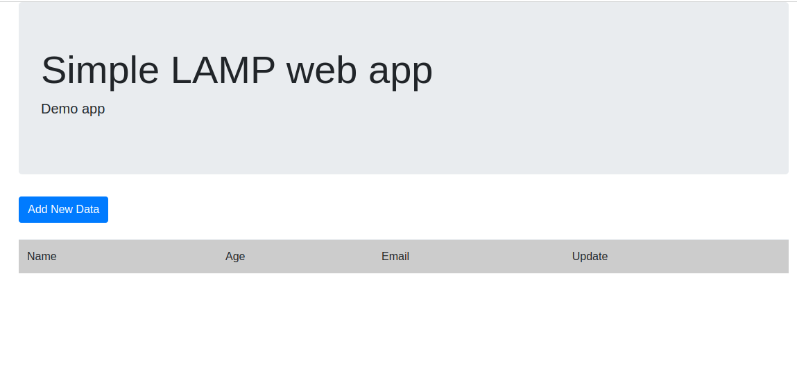
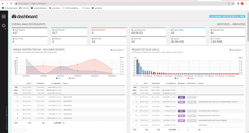

# IAW
# Pila Lamp
- [Scripts de Implantacion de aplicaciones web](apache.sh)
  - Despliegue de la instalación de la aplicación web propuesta.
#https://github.com/josejuansanchez/iaw-practica-lamp/tree/master, nos descargamos el github completo y lo colocamos en la maquina de AWS en el directorio /var/www/html y descomprimimos la carpta en ese directorio
#entramos en mariadb y ejecutamos el scripts que aparece en la carpeta que hemos descomprimido(db) y desde /var/www/html modificamos dos archivos (config.php e index.php)
#config.php
#cambiamos los nombres de la base de datos, el usuario y tal con respecto a lo que hemos ejecutado en mariadb
#index.php
#le añadimos unas lineas para que no de error
#ini_set('display_errors', 1);
#ini_set('display_startup_errors', 1);
#error_reporting(E_ALL);
#Por ultimo entramos en el navegador con la ip publica y accedemos a la carpeta descomprimida(en src) y nos aparece la aplicacion ya instalada

  - Instalación del analizador de logs GoAccess para Apache Server
apt install goaccesss
goaccess /var/log/apache2/access.log 
#(Queremos tener la informacion anterior en formato html), 
mkdir /var/www/html/stats
chmod 777 /var/www/html/stats
goaccess /var/log/apache2/access.log -o /var/www/html/stats/index.html --log-format=COMBINED --real-time-html

